# 動く板Project

## AGVとは？

倉庫や工場で利用される無地搬送するロボット

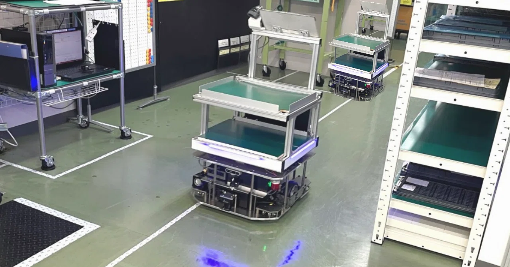
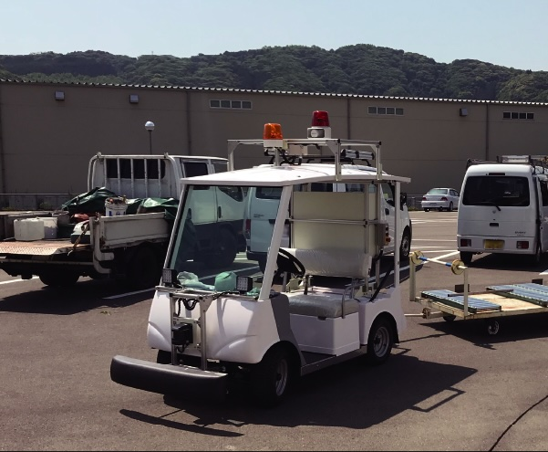

## 動く板Project
# 運搬だけでなく多目的に利用できるAMR

- アタッチメント式でAMRに取り付けることで多用途に利用
例：掃除、自動販売、案内、運搬、広告など
- 目的に合わせたアタッチメントを装着することで機能追加や変更が容易に
  - 専用の機械を導入するよりもコスト削減に 

<!--
header: ""
_paginate: false
-->

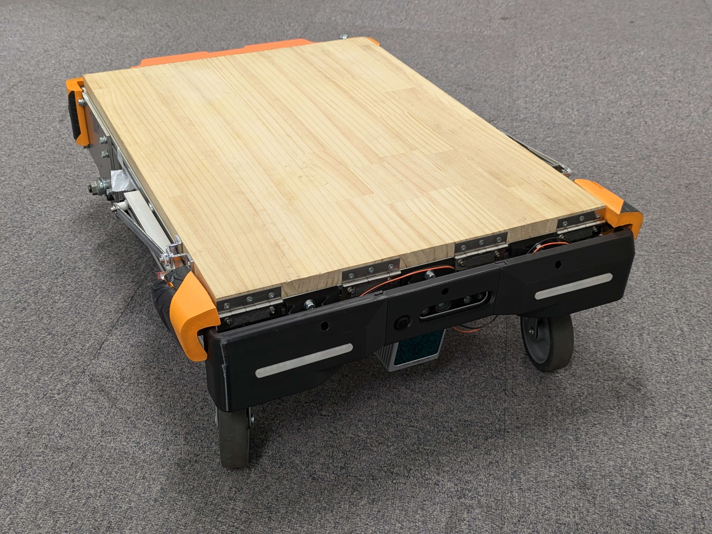

プロトタイプ機

---

<!-- header: アタッチメントで様々な用途に応用可能 -->

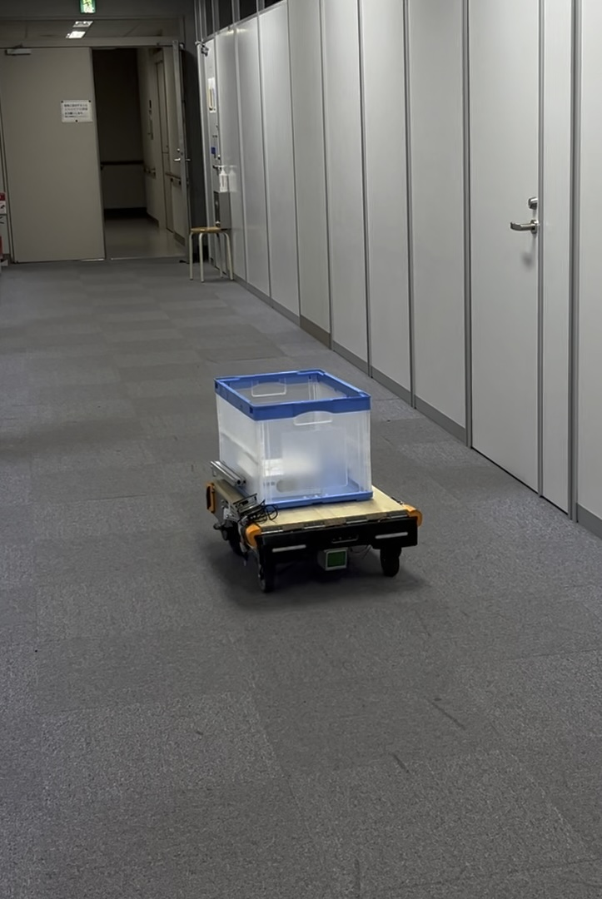
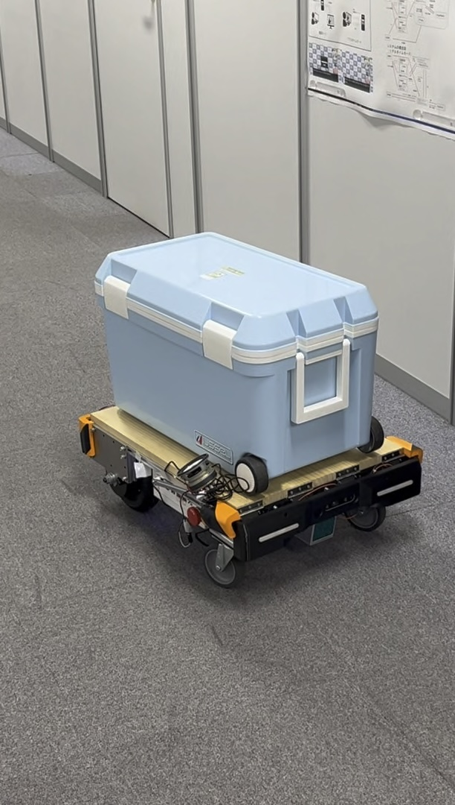
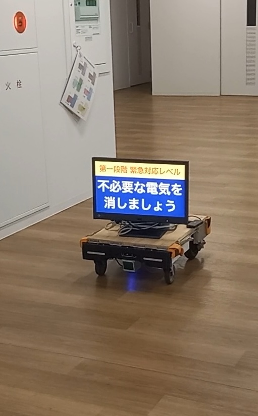

荷物の運搬

移動販売

サイネージ

---

<!-- header: 動く板NEOプロジェクト -->

# 動く板NEOの特徴

- **屋外走行可能**
- 最大積載重量 **200kg**
- 最高速度 **15km/h**
- 走行可能時間 **8時間** (1回の充電)
- 自動運転レベル4 (<u>限定された場所での自動運転</u>) 

---

<!-- header: LiDAR・SLAM・IMUを活用した自律走行 -->

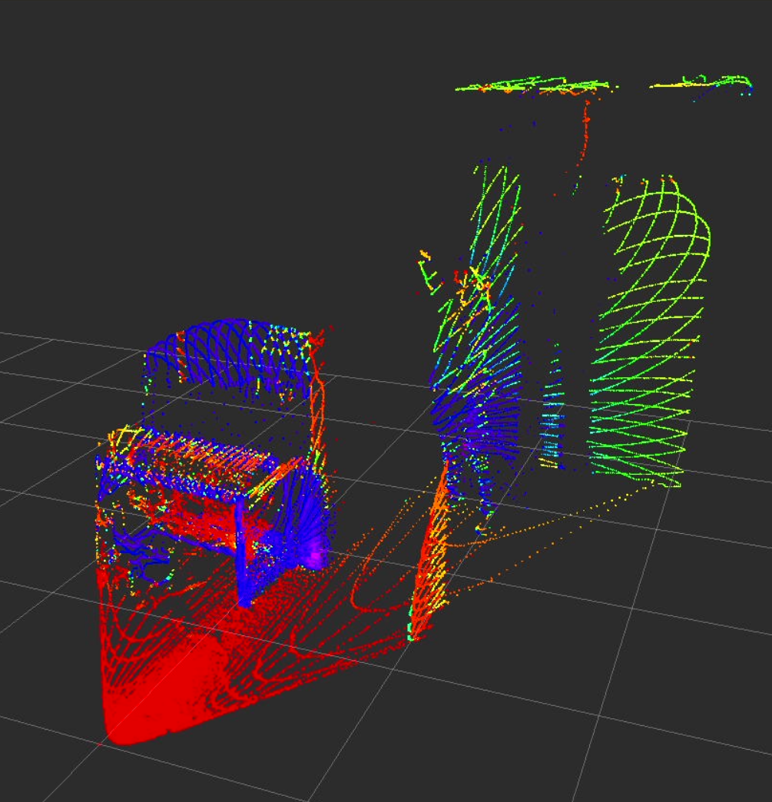
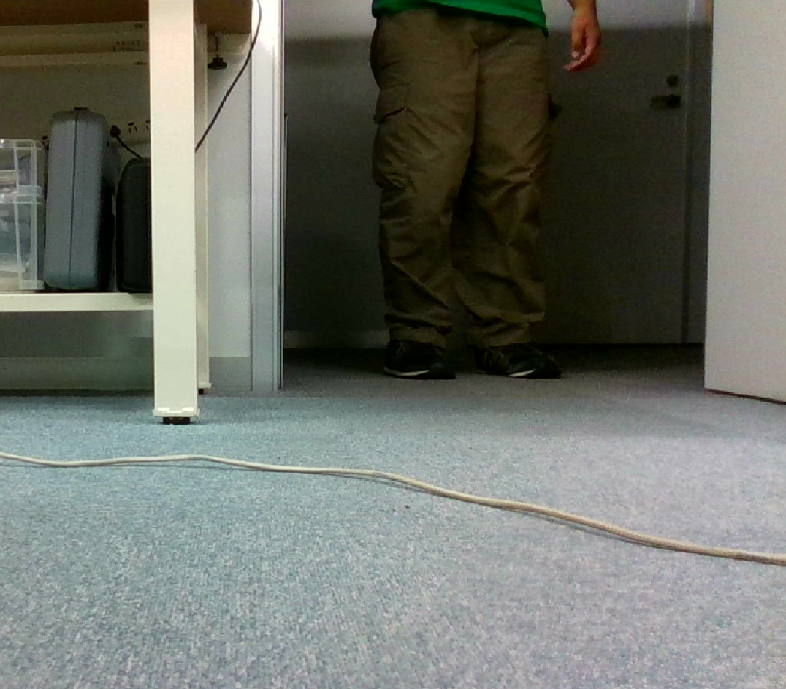

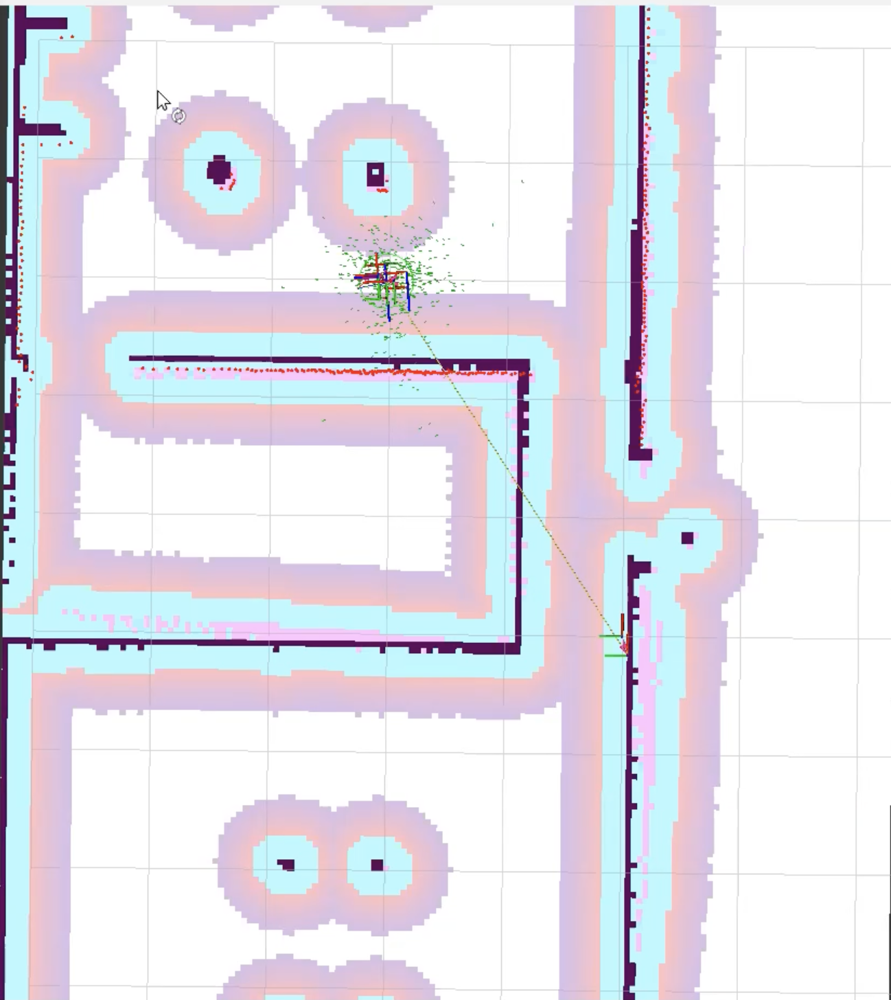

---

<!-- header: 既存製品との比較 -->

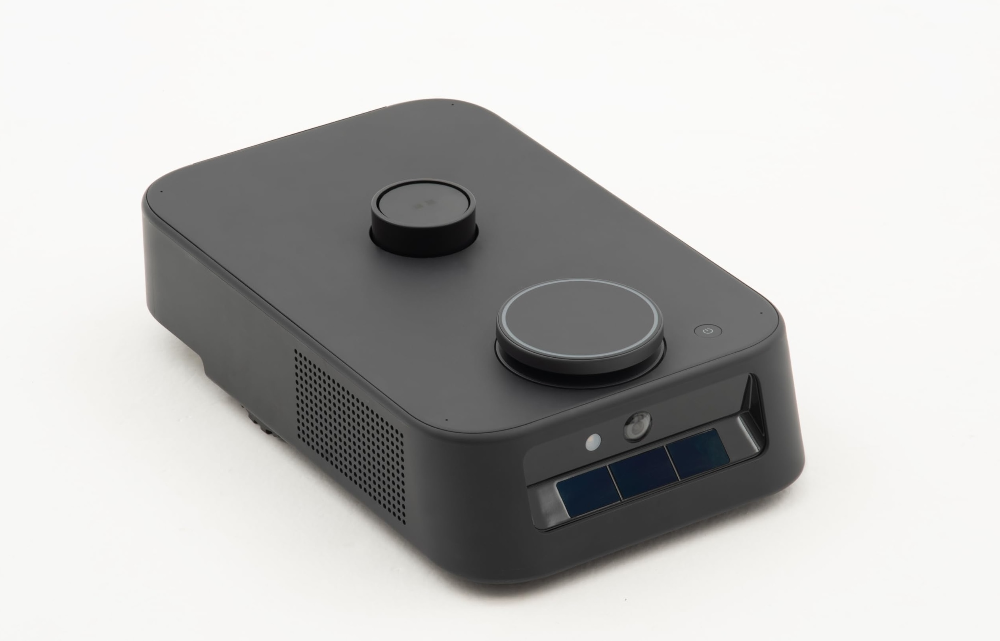
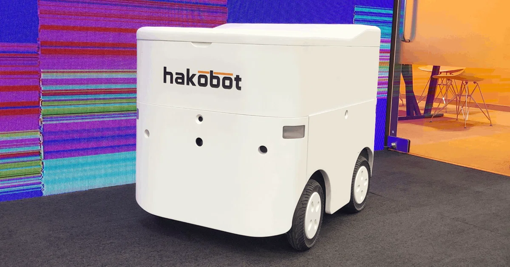

Kachaka 
<small>株式会社Preffered Robotics</small>

Hakobase 
<small>株式会社Hakobot</small>

---

<!-- header: 既存製品との比較 -->

<h1>既存製品との比較</h1>

|  | 動く板 NEO | kachaka | Hakobase |
|:---:|:---:|:---:|:---:|
| 耐荷重 | <red> ◎  <small>200kg</small></red> | ×  <small>10kg</small> | ○  <small>98kg</small>|
| 屋外走行 | <red> ○ </red> | △ | ○ |
| API連携 | <red> ○ </red> | ○ | × |
| 走行速度 | <red>15 km/h</red> | 3 km/h | 6 km/h |
| 稼働時間 | <red>8時間</red> | 2時間 | 5時間 |

---

<!-- header: 他システムとの連携（監視システムの例） -->

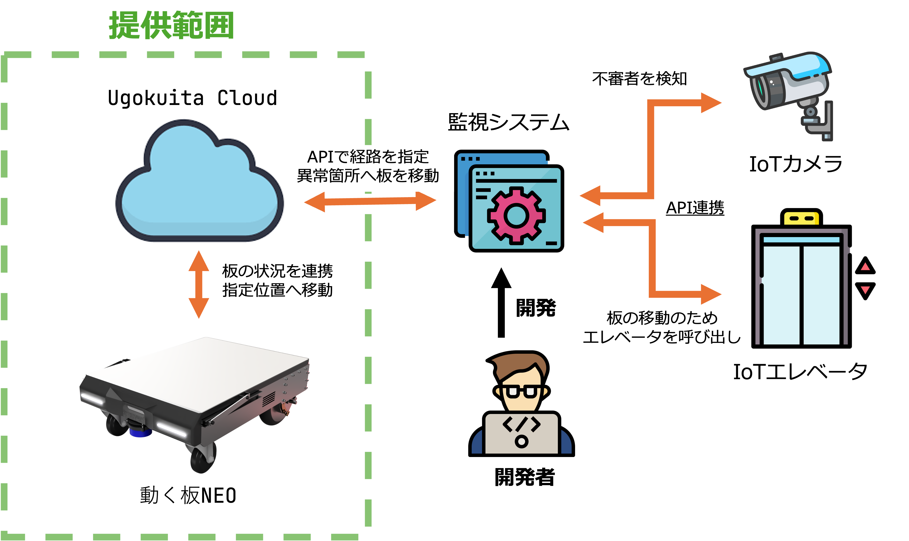

---

<!-- header: エレベータとの連携例 -->

<h4>西9号館での連携実験</h4>

- 人の手を借りず複数階を移動
- 西9号館 IoTシステムと連携

#### <u>新たな価値やサービスの創出へ</u>

> 協力：共創進化スマート社会実現推進機構

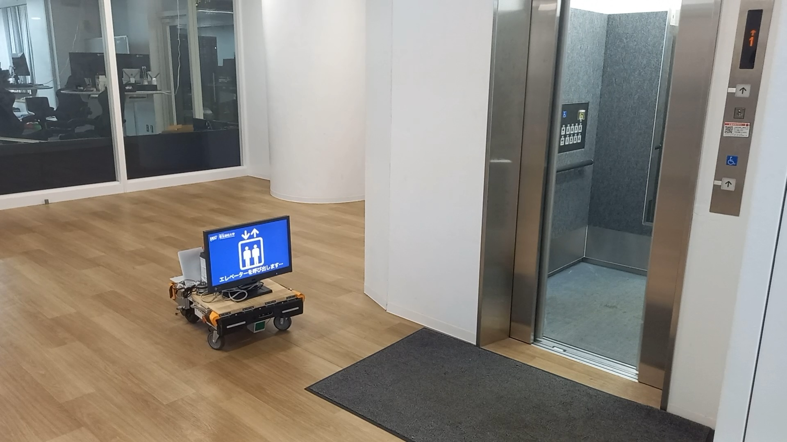

---
<!-- header: "" -->

<h1>動く板NEO デモ映像 (約1分)</h1>

- 基本機能紹介
- <b>利用例: エレベータ連携</b>
- 利用例: 学内配送
- 利用例: サイネージ

## スライド
- [U☆PoC2024発表スライド](./slide.pdf)