<aside class="event-notice" aria-labelledby="event-title">
  

    EXHIBITION
    <h2 id="event-title">Maker Faire Tokyo 2026 に出展中</h2>
    
動く板NEO と制御基板の標準規格「Power Stack 1.0」を展示しています。ぜひブースにお立ち寄りください。

  

  <a class="btn btn--primary" href="#mft2026">配布資料を見る ↗</a>
</aside>

  
ABOUT THE PROJECT

  <h1>つなげて、広がる。 動く板の可能性。</h1>
  
用途に縛られず、システムやハードウェアと連携・拡張できる IoTスマートデバイス「動く板NEO」を開発しています。

  <a class="intro-link" href="#power-stack-title">動く板を支える仕組みへ ↓</a>

  
01 / CONNECT<h2>つなげる。</h2>
様々なシステムやハードウェアと連携。用途に合わせて構成できる、移動するIoTデバイス。

  
02 / EXPAND<h2>拡張する。</h2>
運ぶものも、載せる機器も、使う場所も。特定の用途に縛られないプラットフォームを目指しています。

  
03 / BUILD<h2>つくる。</h2>
ハードウェアから制御まで、自分たちの手で。実機を使いながら、できることを広げています。

<section class="power-stack" aria-labelledby="power-stack-title">
  

    
HARDWARE STANDARD

    <h2 id="power-stack-title">Power Stack 1.0</h2>
    
動く板を支える、 制御基板の標準規格。

    
電源・モータードライバー・センサIOを積み重ねて構成。メカ・信号・安全の共通規格で、ハードウェア開発を支えます。

    <a class="btn btn--primary" href="#mft2026">構成・仕様を資料で見る ↗</a>
  

  
</section>

## 開発・活動の様子

公式Xで公開している、開発と活動の記録です。

  <figure>
    
    <figcaption><time datetime="2026-08-10">2026.08.10</time><a href="https://x.com/ugokuita/status/2086752264275018084">Power Stack 1.0 を展示へ ↗</a></figcaption>
  </figure>
  <figure>
    
    <figcaption><time datetime="2025-11-08">2025.11.08</time><a href="https://x.com/ugokuita/status/1986992575669281250">今日の動く板 ↗</a></figcaption>
  </figure>
  <figure>
    
    <figcaption><time datetime="2025-11-04">2025.11.04</time><a href="https://x.com/ugokuita/status/1985394623519604838">3D自己位置推定の開発 ↗</a></figcaption>
  </figure>

[活動の続きは X (@ugokuita) へ](https://x.com/ugokuita)

## イメージ映像

<video class="product-video" controls playsinline preload="none" aria-label="動く板のデモ動画">
  <source src="/demo.mp4" type="video/mp4">
  <a href="/demo.mp4">デモ動画を開く</a>
</video>

[ニコニコ動画で見る](https://www.nicovideo.jp/watch/sm44853893)

## 配布資料 {#mft2026}

Maker Faire Tokyo 2026 のブースで配布・掲示している資料です。ご自由にダウンロードしてご覧ください。

| 資料 | 内容 | ダウンロード |
| --- | --- | --- |
| ハンドアウト | 動く板NEOのシステム構成・スペックと Power Stack 1.0 の仕様をまとめた配布用チラシ | [handout.pdf](./docs/mft2026/handout.pdf) |
| ポスター | ブースに掲示している展示ポスター（動く板の拡張性・耐久性、Power Stack 1.0 の標準規格） | [poster.pdf](./docs/mft2026/poster.pdf) |

## SNS
- [X (@ugokuita)](https://x.com/ugokuita)

## 外部展示
- 調布祭2023工学研究部展示スペースにて
- NT東京2024動くいたProject
- 調布祭2024
- GUGEN2024
- NT東京2025動く板Project
- MakerFairTokyo2025動く板Project
- U☆PoCアイデアコンテスト2025
- MakerFairTokyo2026動く板Project

## 受賞歴
- [U☆PoCアイデアコンテスト2023 B-Storm賞](https://www.uec.ac.jp/research/venture/2023/contest_2.html)
- [U☆PoCアイデアコンテスト2024 多摩信用金庫賞,G&N賞,B-STORM賞](https://www.uec.ac.jp/research/venture/2023/contest_2.html)
- [第3回マルツエレックアイデアコンテスト最優秀賞](https://www.marutsu.co.jp/sv/ideacontest_announce/3rd/)
- [2/8開催技育博企業賞(株式会社ディー・エヌ・エー)](https://x.com/geek_pjt/status/1888176218295636436)
- [2025年国際イノベーションコンテスト特別賞(技術部門)](http://www.mu-sic.tohoku.ac.jp/ican/ican2025/summary.html)
- [MakerFairTokyo Young Maker Challange 2025 IIJ賞](https://makezine.jp/event/makerfaire/ymc2025/)

## 支援
- MISUMI学生ものづくり支援2024
- meviy for education2025
- JLCPCB

## スライド
- [U☆PoC2024発表スライド](./slide.pdf)

<!-- 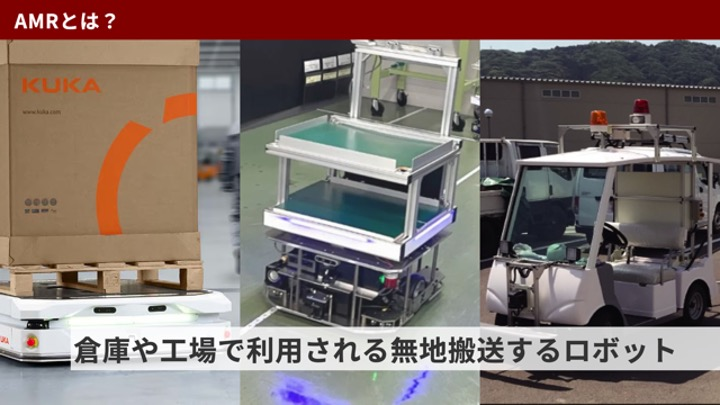
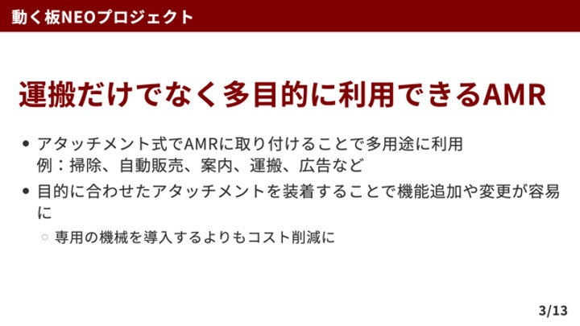
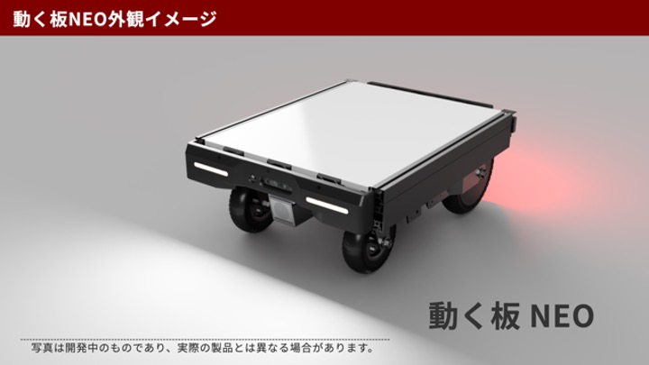
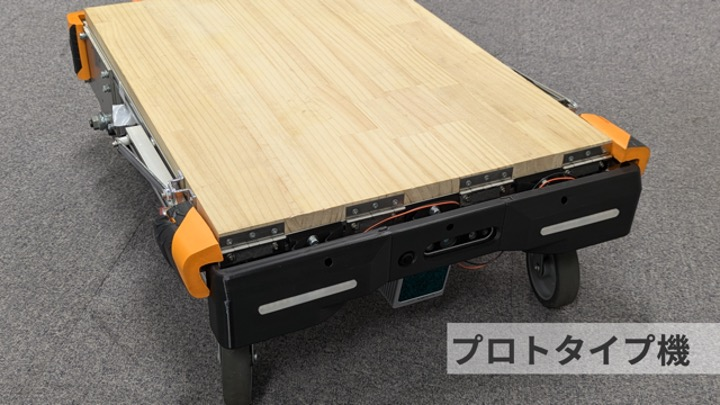
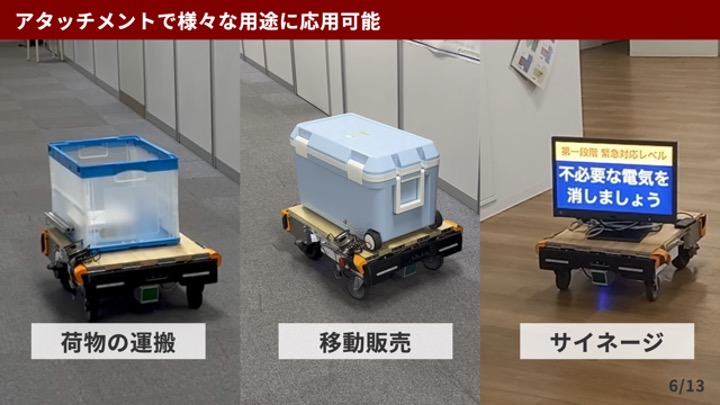
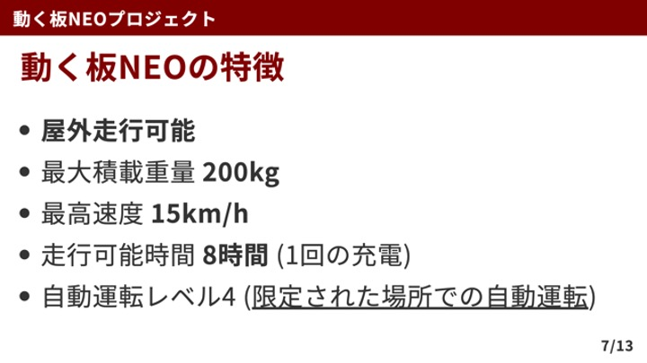
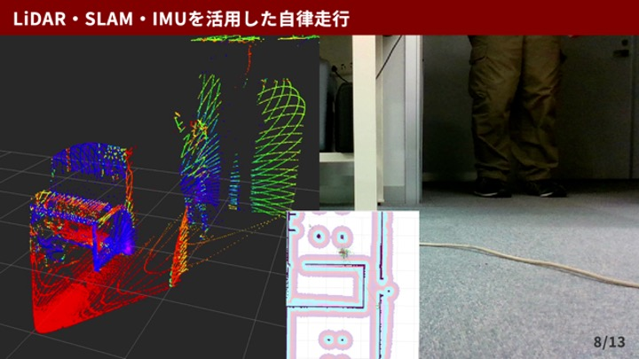
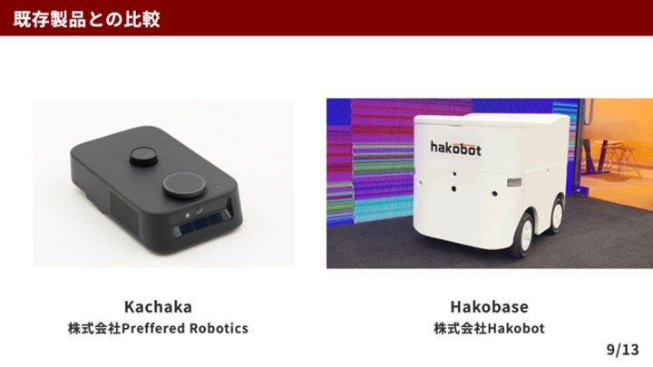
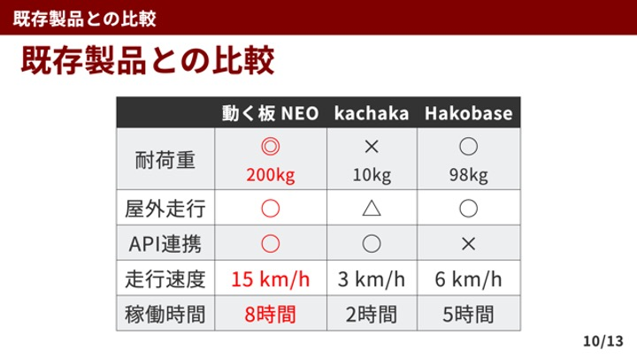
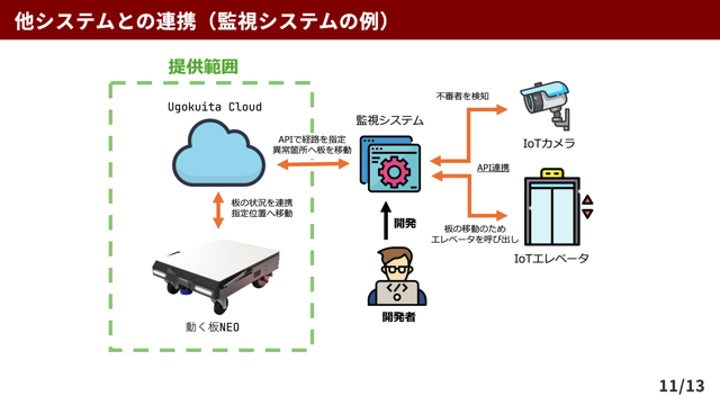
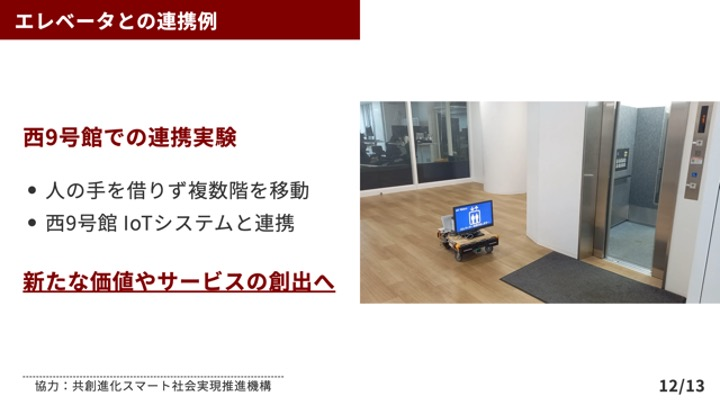 -->

## ゲーム
動く板の操作をブラウザゲームで体験できます！

### 動く板アドベンチャー

動く板で世界を冒険するブラウザゲームです。動く板を操作しましょう。

[ゲームをプレイ](https://acavalkyrie.github.io/ugokuita-adventure-uec/web/)
